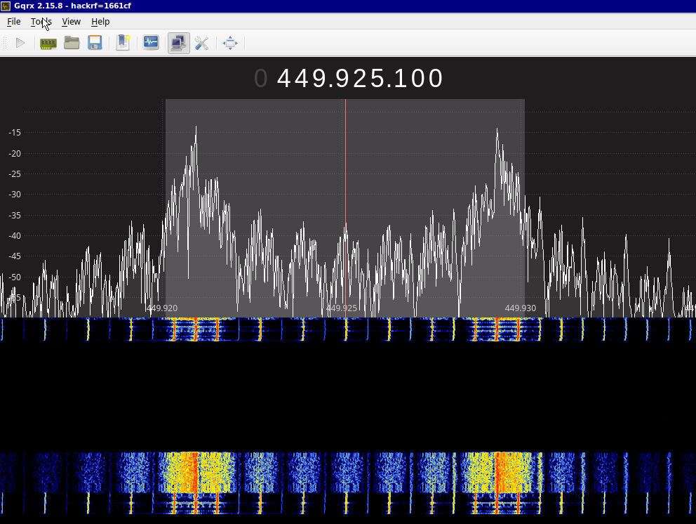
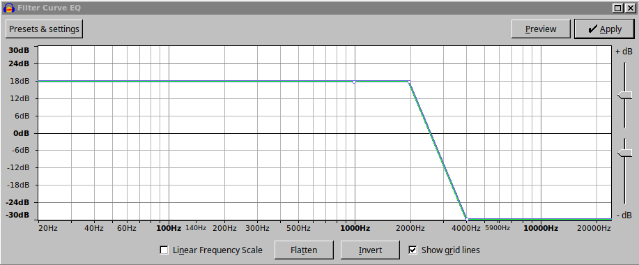
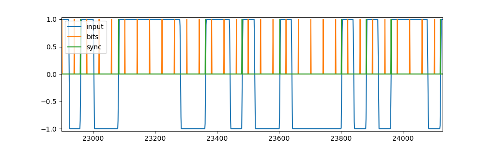
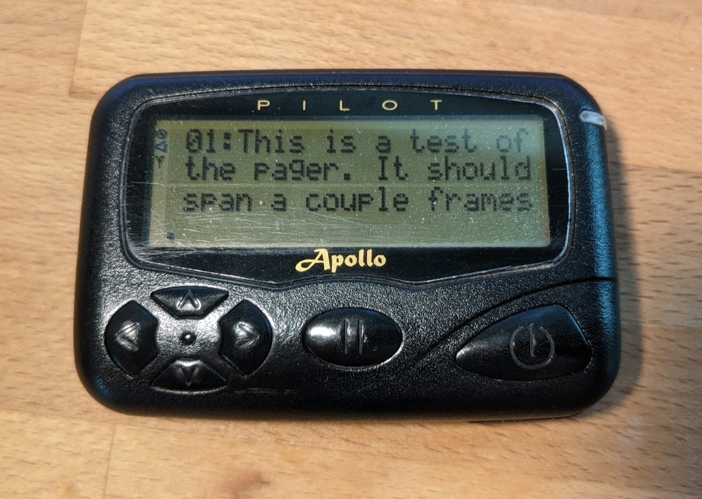

# POCSAG-Decoder
 
This decoder is loosely based on <a href="https://habr.com/en/articles/438906/">this article</a> and adds some extra functionality:
 <ul>
  <li>Address Decoding</li>
  <li>Continuous Resynchronization</li>
  <li>Verbose Data Display</li>
  <li>Sampling Rate Detection</li>
</ul>

I wrote this primarily to make sure that the POGSAG encoder in <a href="https://github.com/jgromes/RadioLib/blob/master/src/protocols/Pager/Pager.cpp">radiolib</a> was doing what it should and also get get a better understanding of exactly how pagers work.

<h2>Data Preparation</h2>

<i>Pager Transmission in GQRX</i>

<ol type="1">
  <li>Use GQRX or other SDR software to record a pager transmission as a WAV file.</li>
  <li>Apply a low pass filter in Audacity and trim the result to start just before the first positive zero crossing and end after the bit period after the last zero crossing. </li>
  <li>Run the python script.</li>
</ol>

<i>Example Low Pass Filter in Audacity</i>

<h2>Address Decoding</h2>

As many references state, the CAP-CODE address is split in two parts: The first 19 bits come from the address field of the address codeword and the last three bits come from the position of the address codeword in the frame. What I could not find was how to translate the position of the address codeword into bits &mdash; there are 16 possible positions within each batch, but three bits distinguish only eight possibilities. Naively, I expected these bits to be encoded such that an address codeword transmitted immediately after a sync word would have LSB 000 and an address codeword transmitted with seven idle codewords between the sync word and address word would have an LSB of 111. I expected this to be the case since I expected this to minimize air time (at most, seven idle words would be transmitted before the address is transmitted). This is <i>not</i> how it works!

 

What actually happens is that the address word is offset from the sync word by 2x the idle words as the LSB of the address. As such, an address with an LSB of 001 has two idle codewords between it and the sync word and an address with an LSB of 111 has fourteen idle codewords between it and the sync word. This is clearly shown in the source code for radiolib's pager library, but I don't see it in other references that come up on Google.

<h2>Continuous Resynchronization</h2>

The example I started with <a href="https://habr.com/en/articles/438906/">here</a> samples the waveform based on assuming its bit period synchronized only to the first zero crossing. I had enough offset in my data compared to the ideal rate of 1200 bps that I was no longer sampling at the right point on the waveform after about 3/4 of a transmission. To solve this, I added some code to resynchronize the sampling points to positive zero crossings.

<i>Input Waveform Along with Bit Sample Points and Resynchronization Events</i>

<h2>Verbose Data Display</h2>

<i>Message Received by Pager</i>

<b>Output of Python Script:</b>

<pre><b>rruark@rruark-MS-7C56</b>:<b>~/Website/website/projects/RF/Pager/python/POCSAG-Decoder</b>$ python3 pager.py
Sampling Rate:  48000
  Preamble: 10101010101010101010101010101010
  Preamble: 10101010101010101010101010101010
  Preamble: 10101010101010101010101010101010
  Preamble: 10101010101010101010101010101010
  Preamble: 10101010101010101010101010101010
  Preamble: 10101010101010101010101010101010
  Preamble: 10101010101010101010101010101010
  Preamble: 10101010101010101010101010101010
  Preamble: 10101010101010101010101010101010
  Preamble: 10101010101010101010101010101010
  Preamble: 10101010101010101010101010101010
  Preamble: 10101010101010101010101010101010
  Preamble: 10101010101010101010101010101010
  Preamble: 10101010101010101010101010101010
  Preamble: 10101010101010101010101010101010
  Preamble: 10101010101010101010101010101010
  Preamble: 10101010101010101010101010101010
  Preamble: 10101010101010101010101010101010
  Sync:     01111100110100100001010111011000
  Idle:     01111010100010011100000110010111
  Idle:     01111010100010011100000110010111
  Idle:     01111010100010011100000110010111
  Idle:     01111010100010011100000110010111
  Idle:     01111010100010011100000110010111
  Idle:     01111010100010011100000110010111
  Idle:     01111010100010011100000110010111
  Idle:     01111010100010011100000110010111
  Addr:     0 100001100100011100 11 10000000011
  Msg:      1 00101010001011100101 01001010010
  Msg:      1 11100111000001010010 11101001010
  Msg:      1 11110011100000101000 10101110111
  Msg:      1 01100000100010111101 00000001010
  Msg:      1 00111100111001011100 10101001000
  Msg:      1 00010111101101100110 01110000100
  Msg:      1 00001000101110001011 01010010000
  Sync:     01111100110100100001010111011000
  Msg:      1 10100110000010000011 00100100000
  Msg:      1 11000011111001110100 00101000110
  Msg:      1 11010011101110100000 11111111010
  Msg:      1 01010010010010111000 11111100010
  Msg:      1 00101100111000101111 01000110100
  Msg:      1 11011101011100110110 11100010011
  Msg:      1 01001100000101100111 01110011111
  Msg:      1 00001111000011011101 00101010000
  Msg:      1 10000010100001100000 00110101101
  Msg:      1 10110001111110111010 11110000000
  Msg:      1 11100001110011011101 01011100111
  Msg:      1 00110000010011001101 00100111010
  Msg:      1 00111100001110110111 11101000111
  Msg:      1 01001111001110111010 11111110101
  Idle:     01111010100010011100000110010111
  Idle:     01111010100010011100000110010111
This Message was addressed to 1100004
Message consists of 7-bit words: 
[&apos;0010101&apos;, &apos;0001011&apos;, &apos;1001011&apos;, &apos;1100111&apos;, &apos;0000010&apos;, &apos;1001011&apos;, &apos;1100111&apos;, &apos;0000010&apos;, &apos;1000011&apos;, &apos;0000010&apos;, &apos;0010111&apos;, &apos;1010011&apos;, &apos;1100111&apos;, &apos;0010111&apos;, &apos;0000010&apos;, &apos;1111011&apos;, &apos;0110011&apos;, &apos;0000010&apos;, &apos;0010111&apos;, &apos;0001011&apos;, &apos;1010011&apos;, &apos;0000010&apos;, &apos;0000111&apos;, &apos;1000011&apos;, &apos;1110011&apos;, &apos;1010011&apos;, &apos;0100111&apos;, &apos;0111010&apos;, &apos;0000010&apos;, &apos;1001001&apos;, &apos;0010111&apos;, &apos;0000010&apos;, &apos;1100111&apos;, &apos;0001011&apos;, &apos;1111011&apos;, &apos;1010111&apos;, &apos;0011011&apos;, &apos;0010011&apos;, &apos;0000010&apos;, &apos;1100111&apos;, &apos;0000111&apos;, &apos;1000011&apos;, &apos;0111011&apos;, &apos;0000010&apos;, &apos;1000011&apos;, &apos;0000010&apos;, &apos;1100011&apos;, &apos;1111011&apos;, &apos;1010111&apos;, &apos;0000111&apos;, &apos;0011011&apos;, &apos;1010011&apos;, &apos;0000010&apos;, &apos;0110011&apos;, &apos;0100111&apos;, &apos;1000011&apos;, &apos;1011011&apos;, &apos;1010011&apos;, &apos;1100111&apos;, &apos;0111010&apos;]
Message decodes in ASCII as: This is a test of the pager. It should span a couple frames.
<b>rruark@rruark-MS-7C56</b>:<b>~/Website/website/projects/RF/Pager/python/POCSAG-Decoder</b>$ 
</pre>
